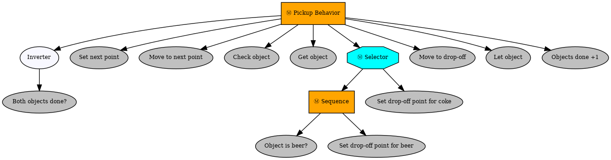

# Lab 2: Task Planning with Behavior Tree

Team members:

Sawera Yaseen - u1992455

Vania Katherine Mulia - u1992883


## Running the Package

To run the package, first run the simulation by launching `pick_up_objects_task.launch`.

```bash
roslaunch pick_up_objects_task pick_up_objects_task.launch
```

Then, in another terminal, run the node in `pickup_behaviors_node.py` by running the command below:

```bash
rosrun pick_up_objects_task pickup_behaviors_node.py
```

## Overview of the Behavior Tree

This behavior tree governs the autonomous process of object pick-off and drop-off of the robotic system. 
At the root of the tree lies the sequence named `Pickup Behavior`, acting as an overarching control structure. This sequence handles the execution flow of the behavior tree ensuring that every leaf node performs in a logical order. The first task of the sequence is `Both objects done`, which checks if both objects (beer, coke) have been successfully handled or not. If not the BT moves to the `Set next point` behavior, to determine the robot’s next point for exploration. Once the exploration point is determined the robot navigates to it through the `Move to next point` behaviors. Later on, the tree executes the `Check object` behavior to detect the object and the `Get Object` behavior to retrieve the object. After object retrieval, the behavior tree determines the designated drop-off points based on the object type using the `Selector` behavior. If the detected object is "beer", the robot navigates to its designated drop-off location using the `Move to drop-off` behavior and the same for the "coke" object. Once the robot reaches the drop-off location of the object it drops it off using the `Let object` behavior. Lastly, the count of the completed tasks is incremented to the counter using the `Objects done + 1` behavior for tracking the tasks. Throughout the complete behavior tree process the “PyTrees” functionalities are utilized for efficient task execution.

The behavior tree can be seen below:



Explanation of each behavior:

* __Both objects done?__: The `Both Objects Done` behavior ensures that the robot completes its task involving both coke and beer objects. This behavior employs the `CheckBlackboardVariableValue` from the `PyTrees` library to assess the value of a blackboard variable named `objects_done`. This variable tallies the number of completed tasks, where each successful object handling increments its count. When the count equals 2, indicating both objects, coke and beer have been successfully handled, this behavior returns a success status. However, this success status is inverted to using the `Inverter` to ensure the failure status instead. This is because this inversion halts the robot's actions if both objects are already completed before exploring all predefined points, thereby streamlining task execution.  In essence, the `Both Objects Done` behavior contributes to the optimization of the robot’s operations by checking  the completion status of both objects even before exploring all predefined points, if so the robot ceases further actions.

* __Set next point__: The `Set Next Point` behavior inherited from `py_trees.behavior.Behavior`  is responsible for determining the robot’s next goal point during its navigation. When initialized, it accesses the blackboard and registers  a key `goal` for writing, to enable the  communication of the next goal point. It then moves to set the next exploration point by selecting a point from a predefined list of exploration points and updating the blackboard variable `goal` with its coordinates. This update enables the robot to navigate to the designated location. The `Set Next Point` behavior integrated with the behavior tree ensures a systematic approach for exploration by updating the robot’s target locations continuously.

* __Move to next point__: The `Move to Next Point` behavior is implemented in a behavior class named `Move` that inherits from `py_trees.behavior.Behavior`. This behavior is responsible for dictating the robot’s movement towards the next predefined exploration point.  It subscribes to odometry messages from ROS topic `odom` to continuously track the robot’s current position. When initialized, it accesses the blackboard to redeem the next exploration point’s coordinates earlier set by the `Set Next Point` behavior.  These coordinates are then published as a goal position to the robot’s navigation system using the `rospy.Publisher`. During the execution, this behavior keeps comparing the robot’s current position with the goal position. If this position aligns with the goal position with the set tolerance it returns a success status, indicating successful navigation. On the contrary, if the robot has not reached the goal point the behavior returns a running status, to allow the navigation process to continue until the robot reaches its goal position. 

* __Object is beer?__: The `is_beer` behavior named `Object is beer?` is instantiated using `py_trees.behaviours.CheckBlackboardVariableValue`, and is used to determine whether the detected object corresponds to a beer item. This behavior makes use of the `ComparisonExpression` class from the `PyTrees` library for comparing the value stored in the blackboard variable `object_name` with the string "beer". If the value stored in `object_name` matches "beer", indicating the detection of a beer item, it returns a success status. In contrast, if the comparison fails, indicating that the detected object is not beer, it returns a failure status. This behavior integrates with the behavior tree to identify beer objects thereby guiding subsequent actions tailored for handling beer objects. 

* __Set drop-off point for beer__: The `set_beer` behavior named `Set drop-off point for beer` is implemented using the `SetBlackboardVariable` class from `PyTrees`. This behavior is responsible for defining the drop-off position of the beer objects. It initializes the blackboard variable named `goal` with the coordinates __(-1.5, -1.5)__, representing the designated point for dropping off beer objects. Additionally the overwrite operation for the variable `goal` is set to true to overwrite any previous goal value and is replaced with the new coordinates ensuring the most recent beer drop-off position is utilized. 

* __Set drop-off point for coke__: The working of the `set_coke` behavior named `Set drop-off point for coke`, is the same as `Set drop-off point for beer` the only difference is that this behavior initializes a blackboard variable named `goal` with the coordinates __(1.5, 1.5)__, representing the designated location where coke items are to be deposited.

* __Move to drop-off__: The `Move to Drop off` behavior is similar to the `Move to next point` behavior in terms of navigation, it only differs in its specific objectives within the task execution process. This behavior directs the robot to designated drop-off points for both beer and coke objects. It accesses the blackboard to take the coordinates of drop-off points stored under the `goal` variable to navigate the robot to that point for depositing the coke or beer object. 

* __Objects done +1__: The `Objects Done + 1` behavior is implemented in a behavior class named `DoneCounter` that inherits from `py_trees.behavior.Behavior`. This behavior is responsible for incrementing the counter of completed objects. It is responsible for managing the count of objects handled by the robot. It establishes communication with the blackboard and registers the `objects_done` key for both reading and writing. Initially, the objects counter is stored on the blackboard as zero to ensure the proper initialization of the counter. Later on in the update method, the behavior retrieves the current count of the completed objects from the blackboard and increments it by 1. Later on, the blackboard is updated with the incremented count  indicating the completion of the object-handling task. The `DoneCounter` behavior through the integration into behavior tree facilitates accurate tracking of completed object-handling tasks.

* It's important to mention here that in addition to the above-defined behaviors, there were other behaviors including __Check object__, __Get object__, and __Let object__ but they were already implemented in the provided behavior class. 

## Online Path Planner and Controller

In addition to the behavior tree, we have included an online path planner which is taken from the previous lab. The implementation of this online path planner includes three files:

* `turtlebot_online_path_planning_node.py`, contains the ROS node of the online planner. Since this node also contains the functionalities of a controller, it replaces the node from `turtlebot_controller_node.py` that was originally given.
* `laser_scan_to_point_cloud_node.py`, contains the ROS node that converts LiDAR scan into point cloud to be used by the online path planner.
* `online_planning.py` file inside `utils_lib` folder, contains the pure Python implementation of state validity checker, path planner (RRT), and controller.

In addition, the online path planner uses octomap server, and thus it is also activated in the launch file (`pick_up_objects_task.launch`) along with the two new ROS nodes mentioned above.

## Results

A demonstration video can be found in this [link](https://drive.google.com/file/d/1sHzoXOs7YxzhDEwoLaUZwWDA-W6nqCSD/view?usp=sharing).

## Issues

**Online path planner considers beer as an obstacle.**

The online path planner implements the state validity checker, which checks if the generated path crosses a known obstacle. This "known" obstacle is based on the robot's LiDAR scan. The LiDAR is a 2D LiDAR fixed on the top part of the robot, and it scans a horizontal plane at fixed height. Unfortunately, due to the height of the beer, parts of the beer lie on the plane of the LiDAR's scan. Thus, when converted into point clouds and used by the online path planner, the beer is considered as an obstacle which affects the path planning. Whenever the robot goes to the exploration point where the beer is located, the online path planner would replan several times even though there seems to be no real obstacles. This is because the generated path passes through the beer's surroundings, and as the beer is considered an obstacle, the path is considered invalid. This is demonstrated in this [video](https://drive.google.com/file/d/1Yw251uU7yRzWVDcHsF5EOOueOyt2u6ow/view?usp=sharing).

To overcome this issue, we made a modification in the scenario setup in which we slightly shift the location to spawn the beer, as one may have noticed in the demo video (in the Results section). The distance to shift the spawn location is set to be greater than the distance threshold in the state validity checker but less than the distance threshold for the robot to detect and grab an object. This consideration is taken so that the exploration point is easily seen as a free space, yet the robot can still detect and grab the beer at the exploration point.

**Online path planner does not consider coke as an obstacle.**

While the path planner considers beer as an obstacle, it does not, however, consider coke as an obstacle. This is due to the size of the coke, making it undetected by the robot's LiDAR as it is not tall enough to reach the LiDAR's plane of scan. Thus, the issue in the previous point does not happen with coke. However, the fact that the coke is not considered an obstacle generates another issue.

Because the online path planner does not know the location of the coke, the planner may generate a path that, in reality, passes the coke. As a consequence, when the robot follows this path, it will get stuck by the coke. This is shown in this [video](https://drive.google.com/file/d/1j4QMAw8LcxdFKtvG1_uXPQW1c92s9G7W/view?usp=sharing).

A possible solution is to implement an algorithm to redirect the robot away from the coke and replan. However, in this package, we have not implemented this solution.

## Conclusions

In this lab, we have implemented a behavior tree to guide a turtlebot in a simple exploration and objects handling task. In implementing some of the behaviors, we have also connected to ROS and combined with an online path planner. While minor issues related to the online path planner exist, in general, the behavior tree works as expected.

